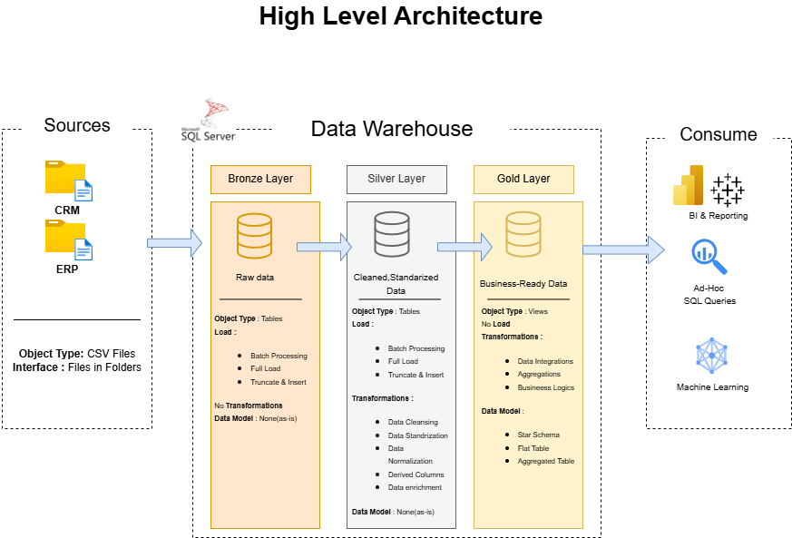

# Data Warehouse & Analytics Project

Welcome to the **Data Warehouse & Analytics Project** repository! 🚀
This project showcases an end-to-end data warehousing and analytics solution, covering everything from building the warehouse infrastructure to delivering meaningful business insights.

## Note

This is a training project that follows the structure of the course “SQL Full Course for Beginners (30 Hours) – From Zero to Hero” by DataWithBaraa.

Thanks to [Baraa](https://linkedin.com/in/baraa-khatib-salkini) for helping me learn SQL and for sharing his approach to project management through his content.


---

## 🏗️ Data Architecture

The architecture follows the **Medallion Architecture** pattern, organized into three progressive layers: **Bronze**, **Silver**, and **Gold**:


1. **Bronze Layer**: Holds raw, unprocessed data exactly as it arrives from source systems. Data is ingested from CSV files into a SQL Server database.
2. **Silver Layer**: Applies cleansing, standardization, and normalization processes to make data reliable and ready for analysis.
3. **Gold Layer**: Contains business-ready data structured as a star schema, optimized for reporting and analytical workloads.

---

## 📖 Project Overview

This project covers the following areas:

1. **Data Architecture**: Designing a modern data warehouse using the Medallion Architecture with Bronze, Silver, and Gold layers.
2. **ETL Pipelines**: Extracting, transforming, and loading data from source systems into the warehouse.
3. **Data Modeling**: Building fact and dimension tables tailored for efficient analytical queries.
4. **Analytics & Reporting**: Producing SQL-based reports and dashboards that surface actionable business insights.

🎯 This repository serves as a strong portfolio reference for professionals and students looking to demonstrate skills in:
- SQL Development
- Data Architecture
- Data Engineering
- ETL Pipeline Development
- Data Modeling
- Data Analytics

---

## 🚀 Project Requirements

### Data Warehouse Build (Data Engineering)

#### Objective
Design and implement a modern data warehouse in SQL Server to centralize sales data, supporting analytical reporting and evidence-based decision-making.

#### Specifications
- **Data Sources**: Ingest data from two source systems (ERP and CRM) provided as CSV files.
- **Data Quality**: Identify and resolve data quality issues before loading data for analysis.
- **Integration**: Merge both sources into a unified, analyst-friendly data model suited for complex queries.
- **Scope**: Work with the most current dataset only; historical tracking is out of scope.
- **Documentation**: Deliver clear and thorough data model documentation for both business stakeholders and technical teams.

---

### BI: Analytics & Reporting (Data Analysis)

#### Objective
Build SQL-driven analytics to generate detailed insights across three key areas:
- **Customer Behavior**
- **Product Performance**
- **Sales Trends**

These insights give stakeholders access to critical business metrics, enabling smarter and more strategic decisions.

For full details, see [docs/requirements.md](docs/requirements.md).

---

## 📂 Repository Structure

```
sql-data-warehouse-project/
│
├── datasets/                           # Raw source datasets (ERP and CRM data)
│
├── docs/                               # Project documentation and architecture references
│   ├── etl.drawio                      # Draw.io diagram covering ETL techniques and methods
│   ├── data_architecture.drawio        # Draw.io diagram of the overall project architecture
│   ├── data_catalog.md                 # Dataset catalog with field descriptions and metadata
│   ├── data_flow.drawio                # Draw.io diagram illustrating the data flow
│   ├── data_models.drawio              # Draw.io diagram of the data models (star schema)
│   ├── naming-conventions.md           # Naming standards for tables, columns, and files
│
├── scripts/                            # SQL scripts for ETL processes and transformations
│   ├── bronze/                         # Scripts for raw data extraction and loading
│   ├── silver/                         # Scripts for data cleansing and transformation
│   ├── gold/                           # Scripts for building analytical models
│
├── tests/                              # Test scripts and data quality checks
│
├── README.md                           # Project overview and setup instructions
├── LICENSE                             # Repository license information
├── .gitignore                          # Files and folders excluded from version control
└── requirements.txt                    # Project dependencies and requirements
```

---

## 🛡️ License

This project is licensed under the [MIT License](LICENSE). You are welcome to use, adapt, and distribute it freely, provided appropriate credit is given.

---

## 🌟 About Me

Hi! I'm **Iván Montero Fernández**, an IT professional with a genuine passion for data. I'm actively building expertise in data engineering as I work toward transitioning from my current role as a software engineer into the data engineering space.

I'd love to connect — reach out on any of the platforms below:

[](https://www.linkedin.com/in/ivanmonterodataengineer)

